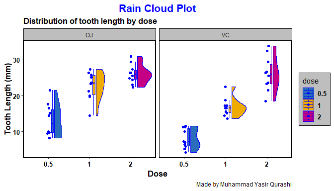
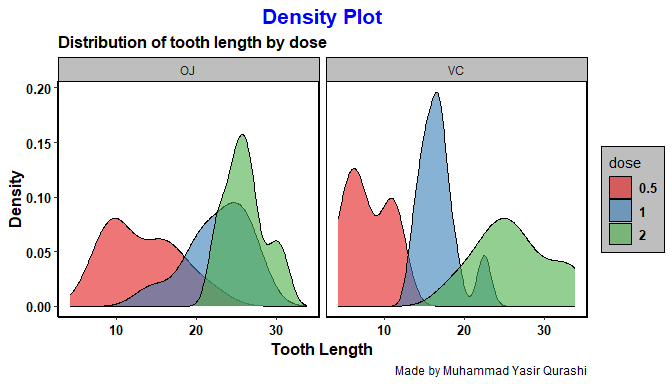
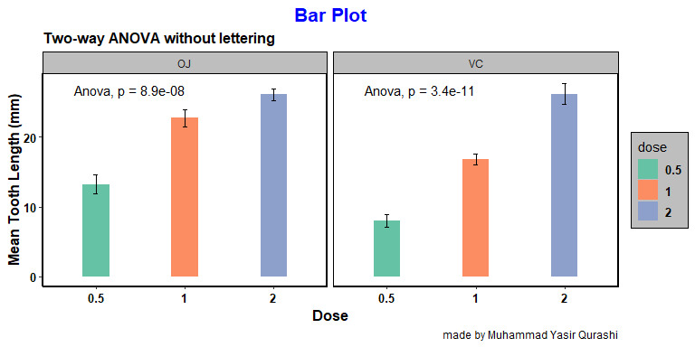
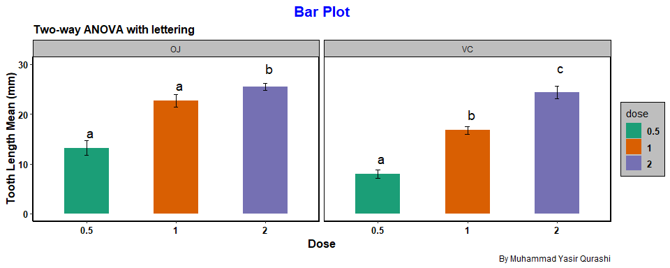
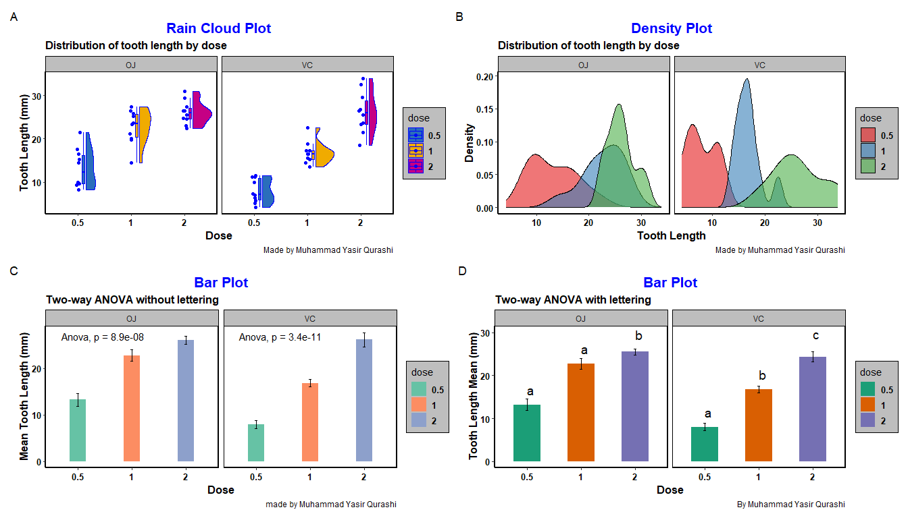

Day_03_scientific_visualization_training
================
By Muhammad Yasir Qurashi
2026-03-03

# **Two-way ANOVA in R**

## Loading libraries

Install these packages before activation if you they are not
pre-installed in your environment

``` r
library(ggplot2)
library(multcompView)
library(ggpubr)
library(tidyverse)
```

    ## ── Attaching core tidyverse packages ──────────────────────── tidyverse 2.0.0 ──
    ## ✔ dplyr     1.2.0     ✔ readr     2.1.5
    ## ✔ forcats   1.0.1     ✔ stringr   1.5.2
    ## ✔ lubridate 1.9.4     ✔ tibble    3.3.0
    ## ✔ purrr     1.1.0     ✔ tidyr     1.3.1
    ## ── Conflicts ────────────────────────────────────────── tidyverse_conflicts() ──
    ## ✖ dplyr::filter() masks stats::filter()
    ## ✖ dplyr::lag()    masks stats::lag()
    ## ℹ Use the conflicted package (<http://conflicted.r-lib.org/>) to force all conflicts to become errors

``` r
library(ggrain)
```

    ## Registered S3 methods overwritten by 'ggpp':
    ##   method                  from   
    ##   heightDetails.titleGrob ggplot2
    ##   widthDetails.titleGrob  ggplot2

``` r
library(ggsci)
library(RColorBrewer)
```

## Creating/loading dataset

``` r
TG <- ToothGrowth
TG$dose <- as.factor(TG$dose)
summary(TG)
```

    ##       len        supp     dose   
    ##  Min.   : 4.20   OJ:30   0.5:20  
    ##  1st Qu.:13.07   VC:30   1  :20  
    ##  Median :19.25           2  :20  
    ##  Mean   :18.81                   
    ##  3rd Qu.:25.27                   
    ##  Max.   :33.90

# **Distribution of Data**

## Raincloud plot

``` r
p1 <- ggplot(data = TG, mapping = aes(x = dose, y = len, fill = dose)) +
  geom_rain(color = "blue")+
  labs(x = "Dose", y = "Tooth Length (mm)", title = "Rain Cloud Plot", subtitle = "Distribution of tooth length by dose", caption = "Made by Muhammad Yasir Qurashi")+
  facet_wrap(~supp)+
  theme(
    axis.title = element_text(size = 12, color = "black", face = "bold"),
    axis.text = element_text(size = 10, color = "black", face = "bold"), 
    axis.line = element_line(linewidth = 1, color = "black"),
    plot.title = element_text(size = 16, color = "blue", face = "bold", hjust = 0.5),
    plot.subtitle = element_text(size = 12,face = "bold"),
    legend.background = element_rect(color = "black", fill = "grey"),
    legend.position = "right",
    legend.text = element_text(size = 10, face = "bold"),
    strip.background = element_rect(color = "black", fill = "grey", width = 3),
    strip.text = element_text(family = "bold"),
    panel.border = element_rect(linewidth = 1),
    panel.grid.major = element_blank(),
    panel.grid.minor = element_blank(),
    panel.background = element_blank()
  )+
  scale_fill_bmj();p1
```

    ## Warning in element_rect(color = "black", fill = "grey", width = 3): `...` must be empty.
    ## ✖ Problematic argument:
    ## • width = 3

    ## Warning in grid.Call(C_stringMetric, as.graphicsAnnot(x$label)): font family
    ## not found in Windows font database

    ## Warning in grid.Call.graphics(C_text, as.graphicsAnnot(x$label), x$x, x$y, :
    ## font family not found in Windows font database

<!-- -->

## Density Plot

``` r
p2 <- ggplot(TG, aes(x = len, fill = dose)) +
  geom_density(alpha = 0.6) +
  labs(
    title = "Density Plot",
    x = "Tooth Length",
    y = "Density", subtitle = "Distribution of tooth length by dose", caption = "Made by Muhammad Yasir Qurashi")+
  facet_wrap(~supp)+
  theme(
    axis.title = element_text(size = 12, color = "black", face = "bold"),
    axis.text = element_text(size = 10, color = "black", face = "bold"), 
    axis.line = element_line(linewidth = 1, color = "black"),
    plot.title = element_text(size = 16, color = "blue", face = "bold", hjust = 0.5),
    plot.subtitle = element_text(size = 12,face = "bold"),
    legend.background = element_rect(color = "black", fill = "grey"),
    legend.position = "right",
    legend.text = element_text(size = 10, face = "bold"),
    strip.background = element_rect(color = "black", fill = "grey", width = 3),
    strip.text = element_text(family = "bold"),
    panel.border = element_rect(linewidth = 1),
    panel.grid.major = element_blank(),
    panel.grid.minor = element_blank(),
    panel.background = element_blank()
  )+
  scale_fill_brewer(palette = "Set1", direction = 1);p2
```

    ## Warning in element_rect(color = "black", fill = "grey", width = 3): `...` must be empty.
    ## ✖ Problematic argument:
    ## • width = 3

    ## Warning in grid.Call(C_textBounds, as.graphicsAnnot(x$label), x$x, x$y, : font
    ## family not found in Windows font database

    ## Warning in grid.Call.graphics(C_text, as.graphicsAnnot(x$label), x$x, x$y, :
    ## font family not found in Windows font database

<!-- -->

## Hypothesis testing steps for one-way ANOVA

**1. Make your hypothesis**

null hypothesis –\> there is no significant interactive effect of dose &
supp on tooth length

alternative –\>there is significant interactive effect of dose & supp on
tooth length

**2. Define your significance level**

alpha = 0.05, C.I = 0.95

**3. Selection of test**

*Two way ANOVA*

**4. Calculation**

``` r
# Normality Check ( first condition of ANOVA)

TG %>% 
  group_by(dose, supp) %>% 
  summarise(
  shapiro_p = shapiro.test(len)$p.value
  )
```

    ## `summarise()` has regrouped the output.
    ## ℹ Summaries were computed grouped by dose and supp.
    ## ℹ Output is grouped by dose.
    ## ℹ Use `summarise(.groups = "drop_last")` to silence this message.
    ## ℹ Use `summarise(.by = c(dose, supp))` for per-operation grouping
    ##   (`?dplyr::dplyr_by`) instead.

    ## # A tibble: 6 × 3
    ## # Groups:   dose [3]
    ##   dose  supp  shapiro_p
    ##   <fct> <fct>     <dbl>
    ## 1 0.5   OJ        0.182
    ## 2 0.5   VC        0.170
    ## 3 1     OJ        0.415
    ## 4 1     VC        0.270
    ## 5 2     OJ        0.815
    ## 6 2     VC        0.919

``` r
 # Data is normal
```

``` r
# Homogenity ( Second Condition for ANOVA)
library(car)
```

    ## Loading required package: carData

    ## 
    ## Attaching package: 'car'

    ## The following object is masked from 'package:dplyr':
    ## 
    ##     recode

    ## The following object is masked from 'package:purrr':
    ## 
    ##     some

``` r
leveneTest(len ~ dose*supp, data = TG, alternative = "two.sided")
```

    ## Levene's Test for Homogeneity of Variance (center = median: "two.sided")
    ##       Df F value Pr(>F)
    ## group  5  1.7086 0.1484
    ##       54

``` r
 # Data is Homogenous too
```

``` r
# ANOVA calculation
results_anova <- aov(len ~ dose*supp, data = TG)
summary(results_anova)
```

    ##             Df Sum Sq Mean Sq F value   Pr(>F)    
    ## dose         2 2426.4  1213.2  92.000  < 2e-16 ***
    ## supp         1  205.3   205.3  15.572 0.000231 ***
    ## dose:supp    2  108.3    54.2   4.107 0.021860 *  
    ## Residuals   54  712.1    13.2                     
    ## ---
    ## Signif. codes:  0 '***' 0.001 '**' 0.01 '*' 0.05 '.' 0.1 ' ' 1

**5. Conclusion**

Two way ANOVA has been done with statistical significant results \* ( n
= 60, p_value \< 0.05 )

# **Graphical Presentation**

## Bargraph without lettering

``` r
p3 <- ggplot(data = TG, mapping = aes(x = dose, y = len, fill = dose))+
  geom_bar(stat = "summary", fun = "mean", width = 0.3, linewidth = 0.5)+
  geom_errorbar(stat = "summary", fun.data = mean_se, width = 0.05, linewidth = 0.7)+
  labs(x = "Dose", y = "Mean Tooth Length (mm)", title = "Bar Plot", subtitle = "Two-way ANOVA without lettering", caption = "made by Muhammad Yasir Qurashi")+
  stat_compare_means(method = "anova", label.y = 26)+
  facet_wrap(~supp)+
    theme(
    axis.title = element_text(size = 12, color = "black", face = "bold"),
    axis.text = element_text(size = 10, color = "black", face = "bold"), 
    axis.line = element_line(linewidth = 1, color = "black"),
    plot.title = element_text(size = 16, color = "blue", face = "bold", hjust = 0.5),
    plot.subtitle = element_text(size = 12,face = "bold"),
    legend.background = element_rect(color = "black", fill = "grey"),
    legend.position = "right",
    legend.text = element_text(size = 10, face = "bold"),
    strip.background = element_rect(color = "black", fill = "grey", width = 3),
    strip.text = element_text(family = "bold"),
    panel.border = element_rect(linewidth = 1),
     panel.grid.major = element_blank(),
    panel.grid.minor = element_blank(),
    panel.background = element_blank()
  ) +
  scale_fill_brewer(palette = "Set2", direction = 1);p3
```

    ## Warning in element_rect(color = "black", fill = "grey", width = 3): `...` must be empty.
    ## ✖ Problematic argument:
    ## • width = 3

    ## Warning in grid.Call(C_textBounds, as.graphicsAnnot(x$label), x$x, x$y, : font
    ## family not found in Windows font database

    ## Warning in grid.Call.graphics(C_text, as.graphicsAnnot(x$label), x$x, x$y, :
    ## font family not found in Windows font database

<!-- -->

## Barplot with lettering

TO make barplot with significant letters there are four steps given
below:

**1. Step 1**

Find group wise mean

``` r
dose_mean <- TG %>% 
  group_by(dose, supp) %>% 
  summarise(
    mean_len = mean(len),
    sd = sd(len)
  );dose_mean
```

    ## `summarise()` has regrouped the output.
    ## ℹ Summaries were computed grouped by dose and supp.
    ## ℹ Output is grouped by dose.
    ## ℹ Use `summarise(.groups = "drop_last")` to silence this message.
    ## ℹ Use `summarise(.by = c(dose, supp))` for per-operation grouping
    ##   (`?dplyr::dplyr_by`) instead.

    ## # A tibble: 6 × 4
    ## # Groups:   dose [3]
    ##   dose  supp  mean_len    sd
    ##   <fct> <fct>    <dbl> <dbl>
    ## 1 0.5   OJ       13.2   4.46
    ## 2 0.5   VC        7.98  2.75
    ## 3 1     OJ       22.7   3.91
    ## 4 1     VC       16.8   2.52
    ## 5 2     OJ       26.1   2.66
    ## 6 2     VC       26.1   4.80

**1. Step 2**

calculation of anova

``` r
anova <- aov(len ~ dose*supp, data = TG)
summary(anova)
```

    ##             Df Sum Sq Mean Sq F value   Pr(>F)    
    ## dose         2 2426.4  1213.2  92.000  < 2e-16 ***
    ## supp         1  205.3   205.3  15.572 0.000231 ***
    ## dose:supp    2  108.3    54.2   4.107 0.021860 *  
    ## Residuals   54  712.1    13.2                     
    ## ---
    ## Signif. codes:  0 '***' 0.001 '**' 0.01 '*' 0.05 '.' 0.1 ' ' 1

**1. Step 3**

Post_hoc test

``` r
tukey <- TukeyHSD(anova)
print(tukey)
```

    ##   Tukey multiple comparisons of means
    ##     95% family-wise confidence level
    ## 
    ## Fit: aov(formula = len ~ dose * supp, data = TG)
    ## 
    ## $dose
    ##         diff       lwr       upr   p adj
    ## 1-0.5  9.130  6.362488 11.897512 0.0e+00
    ## 2-0.5 15.495 12.727488 18.262512 0.0e+00
    ## 2-1    6.365  3.597488  9.132512 2.7e-06
    ## 
    ## $supp
    ##       diff       lwr       upr     p adj
    ## VC-OJ -3.7 -5.579828 -1.820172 0.0002312
    ## 
    ## $`dose:supp`
    ##                 diff        lwr         upr     p adj
    ## 1:OJ-0.5:OJ     9.47   4.671876  14.2681238 0.0000046
    ## 2:OJ-0.5:OJ    12.83   8.031876  17.6281238 0.0000000
    ## 0.5:VC-0.5:OJ  -5.25 -10.048124  -0.4518762 0.0242521
    ## 1:VC-0.5:OJ     3.54  -1.258124   8.3381238 0.2640208
    ## 2:VC-0.5:OJ    12.91   8.111876  17.7081238 0.0000000
    ## 2:OJ-1:OJ       3.36  -1.438124   8.1581238 0.3187361
    ## 0.5:VC-1:OJ   -14.72 -19.518124  -9.9218762 0.0000000
    ## 1:VC-1:OJ      -5.93 -10.728124  -1.1318762 0.0073930
    ## 2:VC-1:OJ       3.44  -1.358124   8.2381238 0.2936430
    ## 0.5:VC-2:OJ   -18.08 -22.878124 -13.2818762 0.0000000
    ## 1:VC-2:OJ      -9.29 -14.088124  -4.4918762 0.0000069
    ## 2:VC-2:OJ       0.08  -4.718124   4.8781238 1.0000000
    ## 1:VC-0.5:VC     8.79   3.991876  13.5881238 0.0000210
    ## 2:VC-0.5:VC    18.16  13.361876  22.9581238 0.0000000
    ## 2:VC-1:VC       9.37   4.571876  14.1681238 0.0000058

**1. Step 4**

Giving Significant Letters

``` r
SL <-  multcompLetters4(anova,tukey)
print(SL)
```

    ## $dose
    ##   2   1 0.5 
    ## "a" "b" "c" 
    ## 
    ## $supp
    ##  OJ  VC 
    ## "a" "b" 
    ## 
    ## $`dose:supp`
    ##   2:VC   2:OJ   1:OJ   1:VC 0.5:OJ 0.5:VC 
    ##    "a"    "a"    "a"    "b"    "b"    "c"

``` r
SL <- data.frame(SL$`dose:supp`$Letters)
SL
```

    ##        SL..dose.supp..Letters
    ## 2:VC                        a
    ## 2:OJ                        a
    ## 1:OJ                        a
    ## 1:VC                        b
    ## 0.5:OJ                      b
    ## 0.5:VC                      c

**1. Step 5**

Combine Significant letters with Mean Table

``` r
dose_mean <- cbind(dose_mean, SL = SL$SL..dose.supp..Letters)
dose_mean
```

    ## # A tibble: 6 × 5
    ## # Groups:   dose [3]
    ##   dose  supp  mean_len    sd SL   
    ##   <fct> <fct>    <dbl> <dbl> <chr>
    ## 1 0.5   OJ       13.2   4.46 a    
    ## 2 0.5   VC        7.98  2.75 a    
    ## 3 1     OJ       22.7   3.91 a    
    ## 4 1     VC       16.8   2.52 b    
    ## 5 2     OJ       26.1   2.66 b    
    ## 6 2     VC       26.1   4.80 c

## Plot

``` r
p4 <- ggplot(data = TG, mapping = aes(x = dose, y = len, fill = dose))+
  geom_bar(stat = "summary", fun = "mean", width = 0.5, linewidth = 0.5)+
  geom_errorbar(stat = "summary", fun.data = mean_se, width = 0.05, linewidth = 0.7)+
  geom_text(data = dose_mean, aes(x = dose, y = mean_len, label = SL), size = 5, hjust = 0, vjust = -1)+
  facet_wrap(~supp)+
  labs(x = "Dose", y = "Tooth Length Mean (mm)", title = "Bar Plot", subtitle = "Two-way ANOVA with lettering", caption = "By Muhammad Yasir Qurashi" )+
    theme(
    axis.title = element_text(size = 12, color = "black", face = "bold"),
    axis.text = element_text(size = 10, color = "black", face = "bold"), 
    axis.line = element_line(linewidth = 1, color = "black"),
    plot.title = element_text(size = 16, color = "blue", face = "bold", hjust = 0.5),
    plot.subtitle = element_text(size = 12,face = "bold"),
    legend.background = element_rect(color = "black", fill = "grey"),
    legend.position = "right",
    legend.text = element_text(size = 10, face = "bold"),
    strip.background = element_rect(color = "black", fill = "grey", width = 3),
    strip.text = element_text(family = "bold"),
    panel.border = element_rect(linewidth = 1),
    panel.grid.major = element_blank(),
    panel.grid.minor = element_blank(),
    panel.background = element_blank()
  ) +
  scale_fill_brewer(palette = "Dark2", direction = 1)+
  ylim(0,30);p4
```

    ## Warning in element_rect(color = "black", fill = "grey", width = 3): `...` must be empty.
    ## ✖ Problematic argument:
    ## • width = 3

    ## Warning: Removed 3 rows containing non-finite outside the scale range
    ## (`stat_summary()`).
    ## Removed 3 rows containing non-finite outside the scale range
    ## (`stat_summary()`).

    ## Warning in grid.Call(C_textBounds, as.graphicsAnnot(x$label), x$x, x$y, : font
    ## family not found in Windows font database

    ## Warning in grid.Call.graphics(C_text, as.graphicsAnnot(x$label), x$x, x$y, :
    ## font family not found in Windows font database

<!-- -->

## Combine Plot

``` r
library(patchwork)

finalplot <- (p1 | p2 ) / (p3 | p4) +
  plot_annotation(tag_levels = "A");finalplot
```

    ## Warning in grid.Call(C_textBounds, as.graphicsAnnot(x$label), x$x, x$y, : font
    ## family not found in Windows font database
    ## Warning in grid.Call(C_textBounds, as.graphicsAnnot(x$label), x$x, x$y, : font
    ## family not found in Windows font database
    ## Warning in grid.Call(C_textBounds, as.graphicsAnnot(x$label), x$x, x$y, : font
    ## family not found in Windows font database

    ## Warning: Removed 3 rows containing non-finite outside the scale range
    ## (`stat_summary()`).
    ## Removed 3 rows containing non-finite outside the scale range
    ## (`stat_summary()`).

    ## Warning in grid.Call(C_textBounds, as.graphicsAnnot(x$label), x$x, x$y, : font
    ## family not found in Windows font database

    ## Warning in grid.Call.graphics(C_text, as.graphicsAnnot(x$label), x$x, x$y, :
    ## font family not found in Windows font database
    ## Warning in grid.Call.graphics(C_text, as.graphicsAnnot(x$label), x$x, x$y, :
    ## font family not found in Windows font database
    ## Warning in grid.Call.graphics(C_text, as.graphicsAnnot(x$label), x$x, x$y, :
    ## font family not found in Windows font database
    ## Warning in grid.Call.graphics(C_text, as.graphicsAnnot(x$label), x$x, x$y, :
    ## font family not found in Windows font database

<!-- -->

Best Regards,

*Muhammad Yasir Qurashi*

Research Data Analysis Tools Mentor
