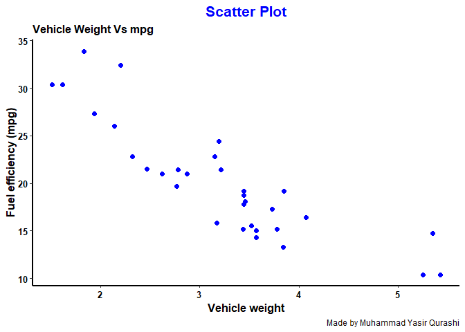
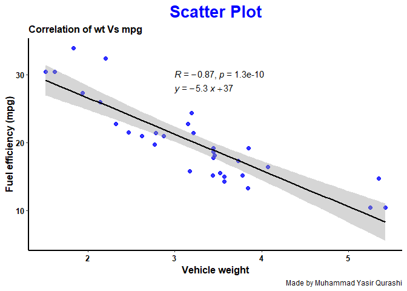
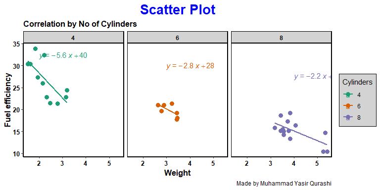
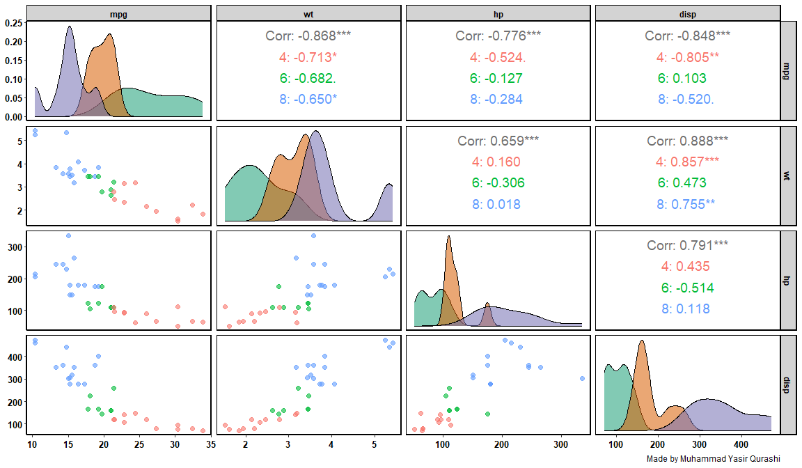
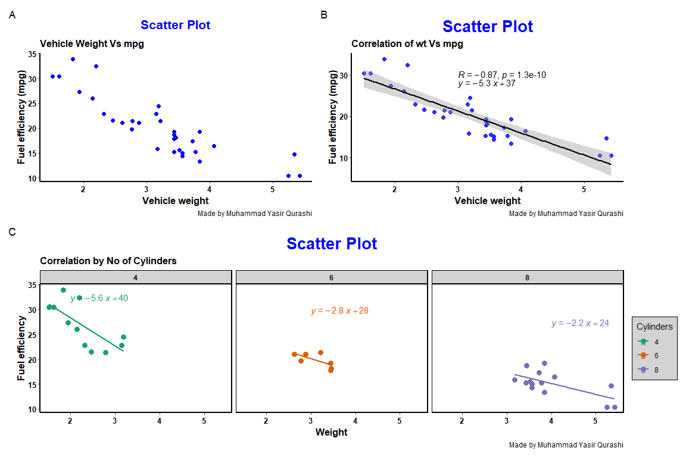

Day_04_scientific_visualization_training
================
By Muhammad Yasir Qurashi
2026-03-06

# **Correlation & Multivariate Relationship Visualization**

## Loading libraries

``` r
library(ggplot2)
library(multcompView)
library(ggpubr)
library(tidyverse)
```

    ## ── Attaching core tidyverse packages ──────────────────────── tidyverse 2.0.0 ──
    ## ✔ dplyr     1.2.0     ✔ readr     2.1.5
    ## ✔ forcats   1.0.1     ✔ stringr   1.5.2
    ## ✔ lubridate 1.9.4     ✔ tibble    3.3.0
    ## ✔ purrr     1.1.0     ✔ tidyr     1.3.1
    ## ── Conflicts ────────────────────────────────────────── tidyverse_conflicts() ──
    ## ✖ dplyr::filter() masks stats::filter()
    ## ✖ dplyr::lag()    masks stats::lag()
    ## ℹ Use the conflicted package (<http://conflicted.r-lib.org/>) to force all conflicts to become errors

``` r
library(ggrain)
```

    ## Registered S3 methods overwritten by 'ggpp':
    ##   method                  from   
    ##   heightDetails.titleGrob ggplot2
    ##   widthDetails.titleGrob  ggplot2

``` r
library(ggsci)
library(RColorBrewer)
```

## Loading dataset

``` r
mt_data <- mtcars
summary(mt_data)
```

    ##       mpg             cyl             disp             hp       
    ##  Min.   :10.40   Min.   :4.000   Min.   : 71.1   Min.   : 52.0  
    ##  1st Qu.:15.43   1st Qu.:4.000   1st Qu.:120.8   1st Qu.: 96.5  
    ##  Median :19.20   Median :6.000   Median :196.3   Median :123.0  
    ##  Mean   :20.09   Mean   :6.188   Mean   :230.7   Mean   :146.7  
    ##  3rd Qu.:22.80   3rd Qu.:8.000   3rd Qu.:326.0   3rd Qu.:180.0  
    ##  Max.   :33.90   Max.   :8.000   Max.   :472.0   Max.   :335.0  
    ##       drat             wt             qsec             vs        
    ##  Min.   :2.760   Min.   :1.513   Min.   :14.50   Min.   :0.0000  
    ##  1st Qu.:3.080   1st Qu.:2.581   1st Qu.:16.89   1st Qu.:0.0000  
    ##  Median :3.695   Median :3.325   Median :17.71   Median :0.0000  
    ##  Mean   :3.597   Mean   :3.217   Mean   :17.85   Mean   :0.4375  
    ##  3rd Qu.:3.920   3rd Qu.:3.610   3rd Qu.:18.90   3rd Qu.:1.0000  
    ##  Max.   :4.930   Max.   :5.424   Max.   :22.90   Max.   :1.0000  
    ##        am              gear            carb      
    ##  Min.   :0.0000   Min.   :3.000   Min.   :1.000  
    ##  1st Qu.:0.0000   1st Qu.:3.000   1st Qu.:2.000  
    ##  Median :0.0000   Median :4.000   Median :2.000  
    ##  Mean   :0.4062   Mean   :3.688   Mean   :2.812  
    ##  3rd Qu.:1.0000   3rd Qu.:4.000   3rd Qu.:4.000  
    ##  Max.   :1.0000   Max.   :5.000   Max.   :8.000

``` r
class(mt_data)
```

    ## [1] "data.frame"

## Variables Interpretation

| Variable | Meaning                            |
|----------|------------------------------------|
| mpg      | Miles per gallon (fuel efficiency) |
| wt       | Car weight (1000 lbs)              |
| hp       | Gross horsepower                   |
| disp     | Engine displacement                |
| cyl      | Number of cylinders                |

## Scientific Research Questions to be Addressed

Is vehicle weight negatively correlated with fuel efficiency (mile per
galloon) ?

Does horsepower predict fuel consumption ?

Are engine size, horsepower, and weight inter-correlated ?

## Scatterplot

``` r
p1 <- ggplot(mt_data, mapping = aes(x = wt, y = mpg)) +
  geom_point(size = 2, color = "blue", alpha = 1) +
  labs(x = "Vehicle weight", y = "Fuel efficiency (mpg)", title = "Scatter Plot", subtitle = "Vehicle Weight Vs mpg", caption = "Made by Muhammad Yasir Qurashi") +
  theme(
    axis.title = element_text(size = 12, color = "black", face = "bold"),
    axis.text = element_text(size = 10, color = "black", face = "bold"), 
    axis.line = element_line(linewidth = 1, color = "black"),
    plot.title = element_text(size = 16, color = "blue", face = "bold", hjust = 0.5),
    plot.subtitle = element_text(size = 12,face = "bold"),
    panel.grid.major = element_blank(),
    panel.grid.minor = element_blank(),
    panel.background = element_blank()
  );p1
```

<!-- -->

## Correlation Plot

``` r
p2 <- ggplot(mt_data, mapping = aes(x = wt, y = mpg)) +
  geom_point(size = 2, color = "blue", alpha = 0.8) +
  geom_smooth(method = "lm", se = TRUE, color = "black")+
  stat_cor(method = "pearson", label.x = 3, label.y = 30)+
  stat_regline_equation(label.x = 3, label.y = 28)+
  labs(x = "Vehicle weight", y = "Fuel efficiency (mpg)", title = "Scatter Plot", subtitle = "Correlation of wt Vs mpg", caption = "Made by Muhammad Yasir Qurashi") +
  theme(
    axis.title = element_text(size = 12, color = "black", face = "bold"),
    axis.text = element_text(size = 10, color = "black", face = "bold"), 
    axis.line = element_line(linewidth = 1, color = "black"),
    plot.title = element_text(size = 20, color = "blue", face = "bold", hjust = 0.5),
    plot.subtitle = element_text(size = 12,face = "bold"),
    panel.grid.major = element_blank(),
    panel.grid.minor = element_blank(),
    panel.background = element_blank()
  );p2
```

    ## `geom_smooth()` using formula = 'y ~ x'

<!-- -->

## Correlation Plot with 3 variables

``` r
p3 <- ggplot(mt_data, mapping = aes(x = wt, y = mpg, colour = factor(cyl))) +
  geom_point(size = 3, alpha = 1) +
  geom_smooth(method = "lm", se = F, width = 2)+
  stat_regline_equation(label.x = c(2,3,4))+
  facet_wrap(~cyl)+
  labs(color = "Cylinders", x = "Weight", y = "Fuel efficiency", title = "Scatter Plot", subtitle = "Correlation by No of Cylinders", caption = "Made by Muhammad Yasir Qurashi") + theme(
    axis.title = element_text(size = 12, color = "black", face = "bold"),
    axis.text = element_text(size = 10, color = "black", face = "bold"), 
    axis.line = element_line(linewidth = 1, color = "black"),
    plot.title = element_text(size = 20, color = "blue", face = "bold", hjust = 0.5),
    plot.subtitle = element_text(size = 12,face = "bold"),
    panel.grid.major = element_blank(),
    panel.grid.minor = element_blank(),
    panel.background = element_blank(),
    strip.background = element_rect(color = "black", fill = "lightgrey", linewidth = 1),
    strip.text = element_text(color = "black", face = "bold"),
    panel.border = element_rect(color = "black", linewidth = 1),
    legend.background = element_rect(fill = "lightgrey", color = "black")
  ) +
  scale_color_brewer(palette = "Dark2");p3
```

    ## Warning in geom_smooth(method = "lm", se = F, width = 2): Ignoring unknown
    ## parameters: `width`

    ## `geom_smooth()` using formula = 'y ~ x'

<!-- -->

``` r
library(GGally)
p4 <- ggpairs(
  mtcars,
  columns = c("mpg", "wt", "hp", "disp"),
  aes(color = factor(cyl), alpha = 0.7),
  lower = list(continuous = wrap("points", alpha = 0.6, size = 2)),
  upper = list(continuous = wrap("cor", size = 5)),
  diag = list(continuous = wrap("densityDiag"))
) +
  scale_fill_brewer(palette = "Dark2", direction = 1)+
  labs(color = "Cylinders",caption = "Made by Muhammad Yasir Qurashi") + 
  theme(
    axis.title = element_text(size = 12, color = "black", face = "bold"),
    axis.text = element_text(size = 10, color = "black", face = "bold"), 
    axis.line = element_line(linewidth = 1, color = "black"),
    plot.title = element_text(size = 20, color = "blue", face = "bold", hjust = 0.5),
    plot.subtitle = element_text(size = 12,face = "bold"),
    panel.grid.major = element_blank(),
    panel.grid.minor = element_blank(),
    panel.background = element_blank(),
    strip.background = element_rect(color = "black", fill = "lightgrey", linewidth = 1),
    strip.text = element_text(color = "black", face = "bold"),
    panel.border = element_rect(color = "black", linewidth = 1));p4
```

    ## Ignoring unknown labels:
    ## • colour : "Cylinders"
    ## Ignoring unknown labels:
    ## • colour : "Cylinders"
    ## Ignoring unknown labels:
    ## • colour : "Cylinders"
    ## Ignoring unknown labels:
    ## • colour : "Cylinders"
    ## Ignoring unknown labels:
    ## • colour : "Cylinders"

<!-- -->

## What Happens here

ggpairs(), automatic creates

| Panel          | Visualization                    |
|----------------|----------------------------------|
| Diagonal       | Distribution (histogram/density) |
| Lower triangle | Scatterplots                     |
| Upper triangle | Correlation coefficients         |

## Interpretation

“Vehicle weight was strongly negatively correlated with fuel efficiency
(r = -0.87, p \< 0.001). Linear regression analysis indicated that
heavier vehicles exhibited significantly reduced miles per gallon.
Engine displacement and horsepower were positively correlated (r =
0.79), suggesting structural coupling between engine size and power
output.”

# Compile figure

``` r
library(patchwork)

final_fig <- (p1 | p2) / (p3) +
  plot_annotation(tag_levels = "A");final_fig
```

    ## `geom_smooth()` using formula = 'y ~ x'
    ## `geom_smooth()` using formula = 'y ~ x'

<!-- -->

Best Regards,

*Muhammad Yasir Qurashi*

Research Data Analysis Tools Mentor
