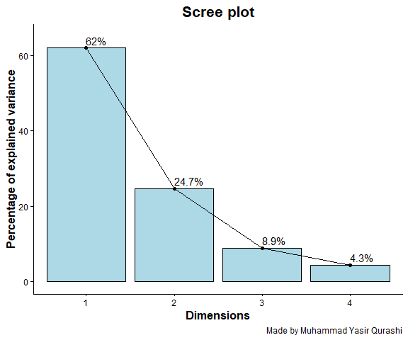
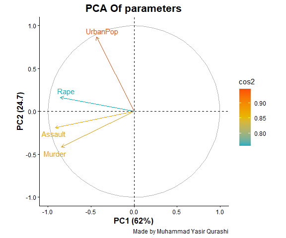
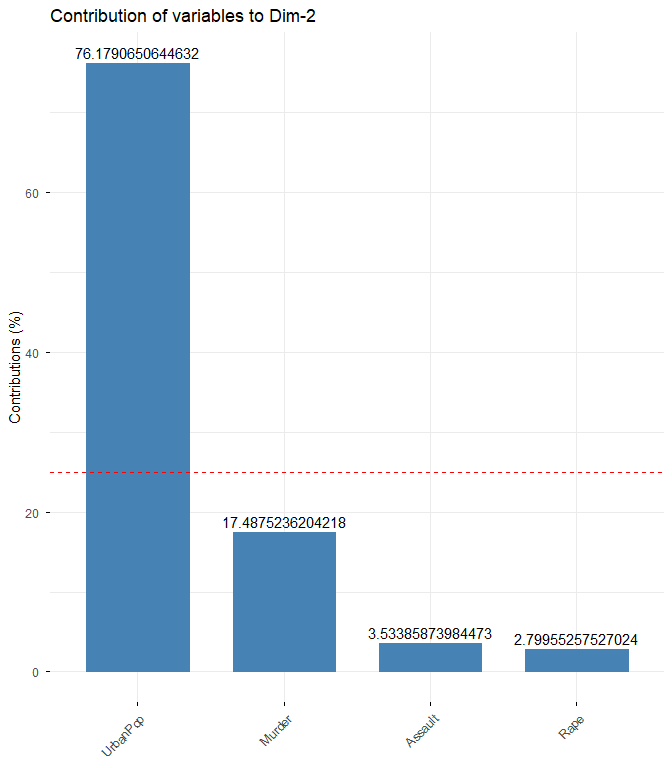
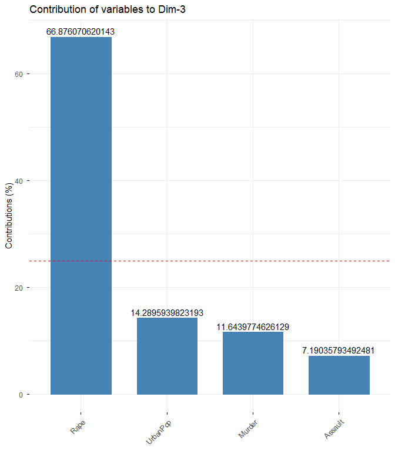
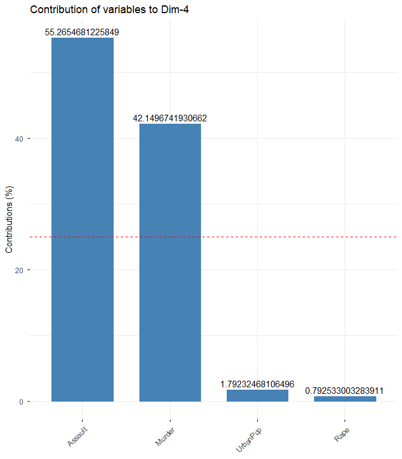
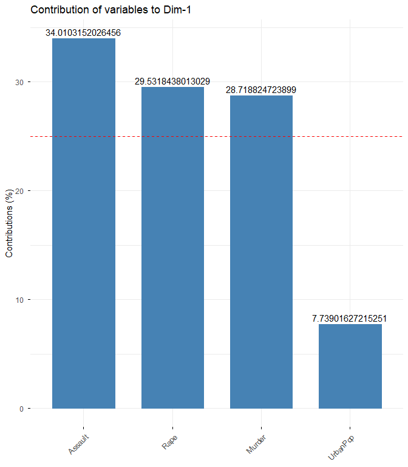
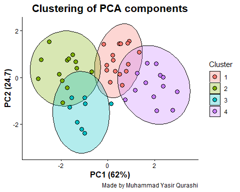

Day_05_scientific_visualization_training
================
By Muhammad Yasir Qurashi
2026-03-08

# **Principal Component analysis in R**

Principal Component Analysis is a dimensionality reduction technique
that transforms correlated variables into a smaller number of
uncorrelated components that capture the major variation in the dataset

## Scientific Questions

- Which states have similar crime patterns?

- Which crime types drive variation across states?

- Can states be clustered into crime profiles?

## Loading dataset

``` r
UA <- USArrests
UA
```

    ##                Murder Assault UrbanPop Rape
    ## Alabama          13.2     236       58 21.2
    ## Alaska           10.0     263       48 44.5
    ## Arizona           8.1     294       80 31.0
    ## Arkansas          8.8     190       50 19.5
    ## California        9.0     276       91 40.6
    ## Colorado          7.9     204       78 38.7
    ## Connecticut       3.3     110       77 11.1
    ## Delaware          5.9     238       72 15.8
    ## Florida          15.4     335       80 31.9
    ## Georgia          17.4     211       60 25.8
    ## Hawaii            5.3      46       83 20.2
    ## Idaho             2.6     120       54 14.2
    ## Illinois         10.4     249       83 24.0
    ## Indiana           7.2     113       65 21.0
    ## Iowa              2.2      56       57 11.3
    ## Kansas            6.0     115       66 18.0
    ## Kentucky          9.7     109       52 16.3
    ## Louisiana        15.4     249       66 22.2
    ## Maine             2.1      83       51  7.8
    ## Maryland         11.3     300       67 27.8
    ## Massachusetts     4.4     149       85 16.3
    ## Michigan         12.1     255       74 35.1
    ## Minnesota         2.7      72       66 14.9
    ## Mississippi      16.1     259       44 17.1
    ## Missouri          9.0     178       70 28.2
    ## Montana           6.0     109       53 16.4
    ## Nebraska          4.3     102       62 16.5
    ## Nevada           12.2     252       81 46.0
    ## New Hampshire     2.1      57       56  9.5
    ## New Jersey        7.4     159       89 18.8
    ## New Mexico       11.4     285       70 32.1
    ## New York         11.1     254       86 26.1
    ## North Carolina   13.0     337       45 16.1
    ## North Dakota      0.8      45       44  7.3
    ## Ohio              7.3     120       75 21.4
    ## Oklahoma          6.6     151       68 20.0
    ## Oregon            4.9     159       67 29.3
    ## Pennsylvania      6.3     106       72 14.9
    ## Rhode Island      3.4     174       87  8.3
    ## South Carolina   14.4     279       48 22.5
    ## South Dakota      3.8      86       45 12.8
    ## Tennessee        13.2     188       59 26.9
    ## Texas            12.7     201       80 25.5
    ## Utah              3.2     120       80 22.9
    ## Vermont           2.2      48       32 11.2
    ## Virginia          8.5     156       63 20.7
    ## Washington        4.0     145       73 26.2
    ## West Virginia     5.7      81       39  9.3
    ## Wisconsin         2.6      53       66 10.8
    ## Wyoming           6.8     161       60 15.6

``` r
summary(UA)
```

    ##      Murder          Assault         UrbanPop          Rape      
    ##  Min.   : 0.800   Min.   : 45.0   Min.   :32.00   Min.   : 7.30  
    ##  1st Qu.: 4.075   1st Qu.:109.0   1st Qu.:54.50   1st Qu.:15.07  
    ##  Median : 7.250   Median :159.0   Median :66.00   Median :20.10  
    ##  Mean   : 7.788   Mean   :170.8   Mean   :65.54   Mean   :21.23  
    ##  3rd Qu.:11.250   3rd Qu.:249.0   3rd Qu.:77.75   3rd Qu.:26.18  
    ##  Max.   :17.400   Max.   :337.0   Max.   :91.00   Max.   :46.00

``` r
head(UA)
```

    ##            Murder Assault UrbanPop Rape
    ## Alabama      13.2     236       58 21.2
    ## Alaska       10.0     263       48 44.5
    ## Arizona       8.1     294       80 31.0
    ## Arkansas      8.8     190       50 19.5
    ## California    9.0     276       91 40.6
    ## Colorado      7.9     204       78 38.7

``` r
tail(UA)
```

    ##               Murder Assault UrbanPop Rape
    ## Vermont          2.2      48       32 11.2
    ## Virginia         8.5     156       63 20.7
    ## Washington       4.0     145       73 26.2
    ## West Virginia    5.7      81       39  9.3
    ## Wisconsin        2.6      53       66 10.8
    ## Wyoming          6.8     161       60 15.6

## Loading Required packages

``` r
library(factoextra)
```

    ## Loading required package: ggplot2

    ## Welcome to factoextra!

    ## Want to learn more? See two factoextra-related books at https://www.datanovia.com/en/product/practical-guide-to-principal-component-methods-in-r/

``` r
library(cluster)
library(ggfortify)
library(tidyverse)
```

    ## ── Attaching core tidyverse packages ──────────────────────── tidyverse 2.0.0 ──
    ## ✔ dplyr     1.2.0     ✔ readr     2.1.5
    ## ✔ forcats   1.0.1     ✔ stringr   1.5.2
    ## ✔ lubridate 1.9.4     ✔ tibble    3.3.0
    ## ✔ purrr     1.1.0     ✔ tidyr     1.3.1

    ## ── Conflicts ────────────────────────────────────────── tidyverse_conflicts() ──
    ## ✖ dplyr::filter() masks stats::filter()
    ## ✖ dplyr::lag()    masks stats::lag()
    ## ℹ Use the conflicted package (<http://conflicted.r-lib.org/>) to force all conflicts to become errors

# **Principal Component Analysis (PCA)**

## Step:01 Data Standardization

Why we do it

Variables have different scales, if we do not standardize them variable
with large scale dominates the other variable

``` r
scale_UA <- scale(UA)

# What does scale mean

# mean = 0
# standard deviation = 1
# Now each variable contributes equally.
```

## Step 02 Run PCA

Why we do it

PCA identifies major patterns of variation

``` r
pca_result <- prcomp(scale_UA)
pca_result
```

    ## Standard deviations (1, .., p=4):
    ## [1] 1.5748783 0.9948694 0.5971291 0.4164494
    ## 
    ## Rotation (n x k) = (4 x 4):
    ##                 PC1        PC2        PC3         PC4
    ## Murder   -0.5358995 -0.4181809  0.3412327  0.64922780
    ## Assault  -0.5831836 -0.1879856  0.2681484 -0.74340748
    ## UrbanPop -0.2781909  0.8728062  0.3780158  0.13387773
    ## Rape     -0.5434321  0.1673186 -0.8177779  0.08902432

``` r
summary(pca_result)
```

    ## Importance of components:
    ##                           PC1    PC2     PC3     PC4
    ## Standard deviation     1.5749 0.9949 0.59713 0.41645
    ## Proportion of Variance 0.6201 0.2474 0.08914 0.04336
    ## Cumulative Proportion  0.6201 0.8675 0.95664 1.00000

## Step 03 Scree plot

Why we use it

The scree plot answers, how many principal components should we keep?

It shows variance explained by each PC.

``` r
p1 <- fviz_eig(pca_result, addlabels = T, ylim = c(0, 65), barfill = "lightblue", barcolor = "black") +
  theme_classic() +
  labs( title = "Scree plot", x = "Dimensions", y = "Percentage of explained variance", caption = "Made by Muhammad Yasir Qurashi") +
  theme(
    axis.title = element_text(size = 12, color = "black", face = "bold"),
    plot.title = element_text(size = 16, color = "black", face = "bold", hjust = 0.5)
  );p1
```

<!-- -->

``` r
# Iterpretation

# Pca1 & pca2 shows 87% variation, since most information in dataset is captured by first two components
```

## Step 04 Variables correlation circle

Why this is powerful

This plot visualizes relationships among variables.

It shows:

- variable correlations

- variable influence

- variable grouping

``` r
p2 <- fviz_pca_var( pca_result, col.var = "cos2", gradient.cols = c("#00AFBB", "#E7B800", "#FC4E07"), repel = TRUE ) +
  theme_classic() +
  labs( title = "PCA Of parameters", x = "PC1 (62%)", y = "PC2 (24.7)", caption = "Made by Muhammad Yasir Qurashi") +
  theme(
    axis.title = element_text(size = 12, color = "black", face = "bold"),
    plot.title = element_text(size = 16, color = "black", face = "bold", hjust = 0.5)
  );p2
```

<!-- -->

*Interpretation rules*

What the Circle Means

- The circle represents maximum correlation (r = 1)

| Pattern               | Meaning                     |
|-----------------------|-----------------------------|
| Arrows close together | strong positive correlation |
| Opposite arrows       | negative correlation        |
| 90° angle             | no correlation              |
| Long arrow            | strong variable influence   |

In above figure; Murder and assault variables clustered closely together
in the correlation circle, indicating strong positive correlation
between these crime indicators across states.

## Step 05 Checking Contribution of each variable to PCA components

``` r
p4 <- fviz_contrib(pca_result, choice = "var", axes = 1, label = T); fviz_contrib(pca_result, choice = "var", axes = 2, label = T);  fviz_contrib(pca_result, choice = "var", axes = 3, label = T); fviz_contrib(pca_result, choice = "var", axes = 4, label = T);p4
```

<!-- --><!-- --><!-- --><!-- -->

## K_means Clustering of PCA scores

``` r
k_cluster <- kmeans(scale_UA, centers = 4)
k_cluster
```

    ## K-means clustering with 4 clusters of sizes 16, 13, 8, 13
    ## 
    ## Cluster means:
    ##       Murder    Assault   UrbanPop        Rape
    ## 1 -0.4894375 -0.3826001  0.5758298 -0.26165379
    ## 2  0.6950701  1.0394414  0.7226370  1.27693964
    ## 3  1.4118898  0.8743346 -0.8145211  0.01927104
    ## 4 -0.9615407 -1.1066010 -0.9301069 -0.96676331
    ## 
    ## Clustering vector:
    ##        Alabama         Alaska        Arizona       Arkansas     California 
    ##              3              2              2              3              2 
    ##       Colorado    Connecticut       Delaware        Florida        Georgia 
    ##              2              1              1              2              3 
    ##         Hawaii          Idaho       Illinois        Indiana           Iowa 
    ##              1              4              2              1              4 
    ##         Kansas       Kentucky      Louisiana          Maine       Maryland 
    ##              1              4              3              4              2 
    ##  Massachusetts       Michigan      Minnesota    Mississippi       Missouri 
    ##              1              2              4              3              2 
    ##        Montana       Nebraska         Nevada  New Hampshire     New Jersey 
    ##              4              4              2              4              1 
    ##     New Mexico       New York North Carolina   North Dakota           Ohio 
    ##              2              2              3              4              1 
    ##       Oklahoma         Oregon   Pennsylvania   Rhode Island South Carolina 
    ##              1              1              1              1              3 
    ##   South Dakota      Tennessee          Texas           Utah        Vermont 
    ##              4              3              2              1              4 
    ##       Virginia     Washington  West Virginia      Wisconsin        Wyoming 
    ##              1              1              4              4              1 
    ## 
    ## Within cluster sum of squares by cluster:
    ## [1] 16.212213 19.922437  8.316061 11.952463
    ##  (between_SS / total_SS =  71.2 %)
    ## 
    ## Available components:
    ## 
    ## [1] "cluster"      "centers"      "totss"        "withinss"     "tot.withinss"
    ## [6] "betweenss"    "size"         "iter"         "ifault"

``` r
scores <- as.data.frame(pca_result$x)

head(scores)
```

    ##                   PC1        PC2         PC3          PC4
    ## Alabama    -0.9756604 -1.1220012  0.43980366  0.154696581
    ## Alaska     -1.9305379 -1.0624269 -2.01950027 -0.434175454
    ## Arizona    -1.7454429  0.7384595 -0.05423025 -0.826264240
    ## Arkansas    0.1399989 -1.1085423 -0.11342217 -0.180973554
    ## California -2.4986128  1.5274267 -0.59254100 -0.338559240
    ## Colorado   -1.4993407  0.9776297 -1.08400162  0.001450164

``` r
scores$Cluster <- factor(k_cluster$cluster)

p3 <- ggplot(scores, aes(PC1, PC2, color = Cluster, fill = Cluster)) +
  stat_ellipse( geom = "polygon", alpha = 0.3, color = "black") +
  geom_point( shape = 21, size = 3, color = "black" ) +
  theme_classic() +
   labs( title = "Clustering of PCA components", x = "PC1 (62%)", y = "PC2 (24.7)", caption = "Made by Muhammad Yasir Qurashi") +
  theme(
    axis.title = element_text(size = 12, color = "black", face = "bold"),
    plot.title = element_text(size = 16, color = "black", face = "bold", hjust = 0.5)
  );p3
```

<!-- -->

Best Regards,

*Muhammad Yasir Qurashi*

Research Data Analysis Tools Mentor
