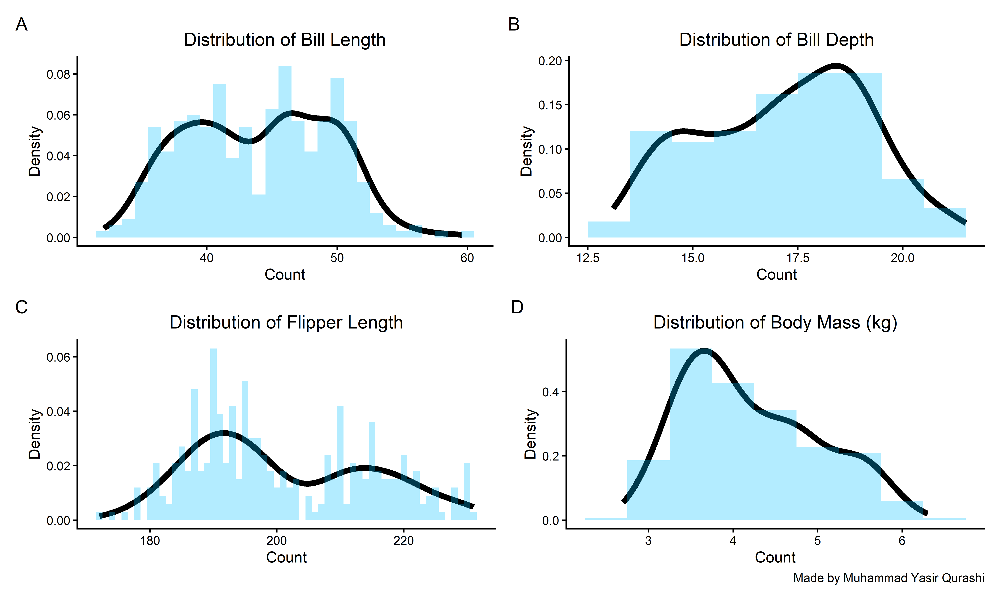
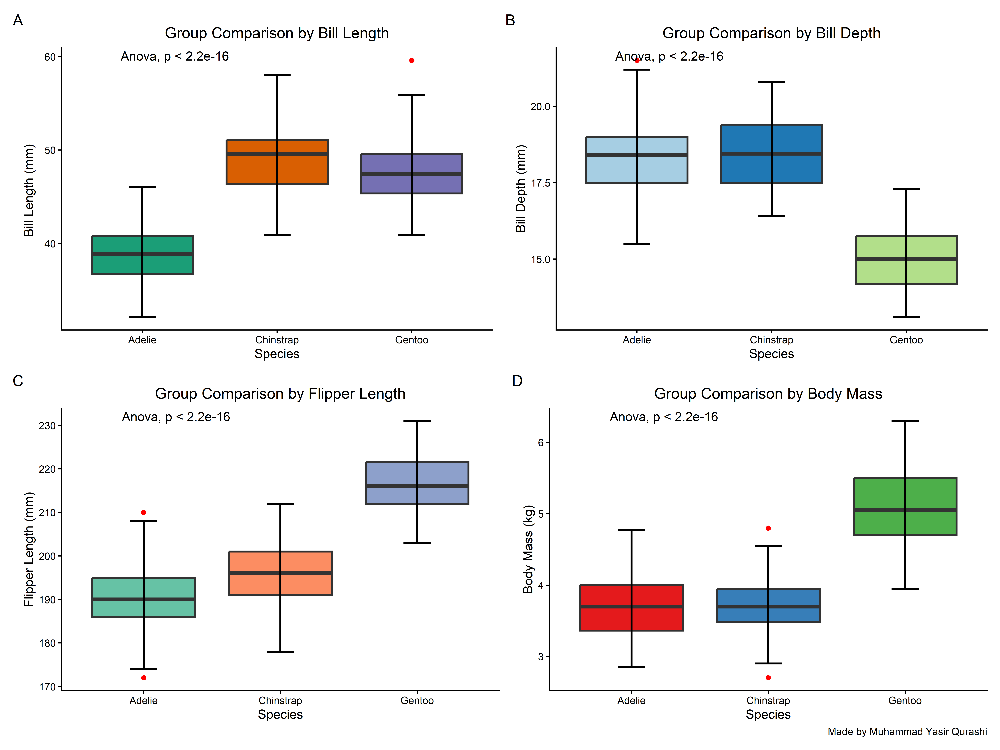
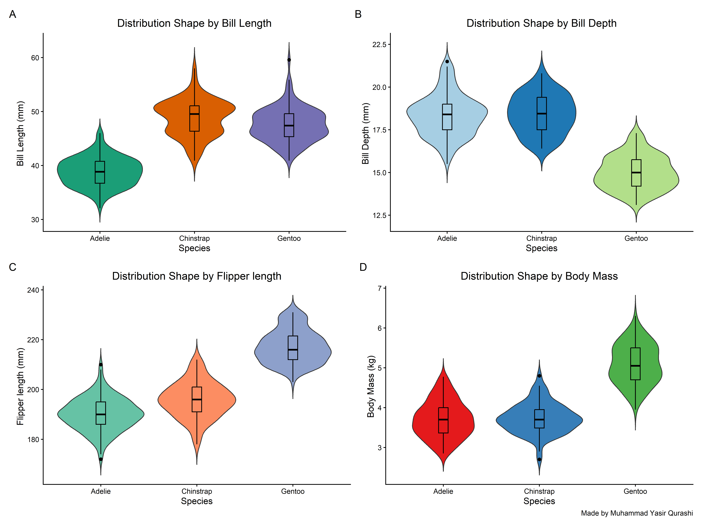
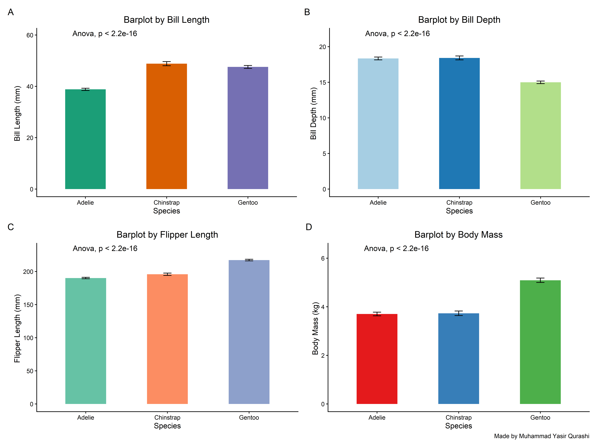
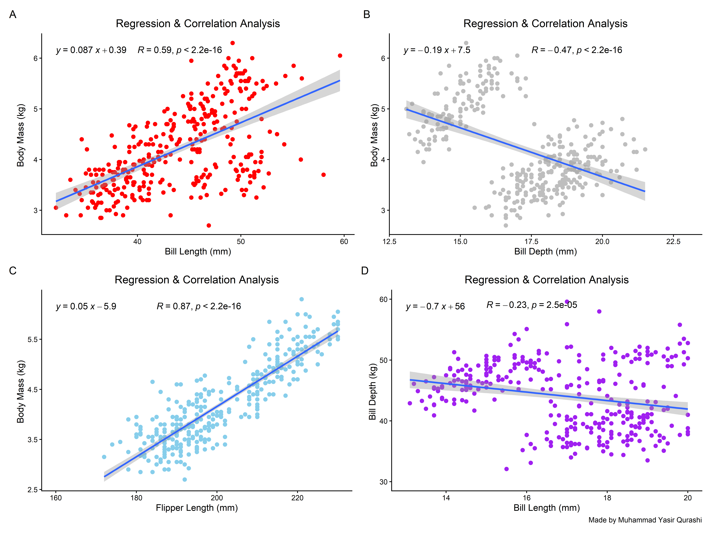

Short_guide_to_make_publication_ready_plots
================
By Muhammad Yasir Qurashi
2026-03-18

> Objective

Create *5 essential scientific plots* using a structured workflow:

- Start from basic visualization

- Upgrade to publication-ready figures

- Add statistical annotations

- Ensure reproducibility

> Loading libraries

Make sure to install these packages in your console and then load in
your environment

``` r
library(tidyverse)
```

    ## ── Attaching core tidyverse packages ──────────────────────── tidyverse 2.0.0 ──
    ## ✔ dplyr     1.2.0     ✔ readr     2.1.5
    ## ✔ forcats   1.0.1     ✔ stringr   1.5.2
    ## ✔ ggplot2   4.0.2     ✔ tibble    3.3.0
    ## ✔ lubridate 1.9.4     ✔ tidyr     1.3.1
    ## ✔ purrr     1.1.0     
    ## ── Conflicts ────────────────────────────────────────── tidyverse_conflicts() ──
    ## ✖ dplyr::filter() masks stats::filter()
    ## ✖ dplyr::lag()    masks stats::lag()
    ## ℹ Use the conflicted package (<http://conflicted.r-lib.org/>) to force all conflicts to become errors

``` r
library(ggpubr)
library(RColorBrewer)
library(viridis)
```

    ## Loading required package: viridisLite

``` r
library(patchwork)
library(palmerpenguins)
```

    ## 
    ## Attaching package: 'palmerpenguins'
    ## 
    ## The following objects are masked from 'package:datasets':
    ## 
    ##     penguins, penguins_raw

> Dataset loading & Cleaning

``` r
# 1. Datasetloading

data <- penguins # store dataset in data 

# 2. Checking null values

data %>% is.na() %>% colSums() # Computing null values in all columns
```

    ##           species            island    bill_length_mm     bill_depth_mm 
    ##                 0                 0                 2                 2 
    ## flipper_length_mm       body_mass_g               sex              year 
    ##                 2                 2                11                 0

``` r
# 3. Removing null values

data <- data %>% drop_na()

data %>% is.na() %>% colSums() # Checking if still null values are present
```

    ##           species            island    bill_length_mm     bill_depth_mm 
    ##                 0                 0                 0                 0 
    ## flipper_length_mm       body_mass_g               sex              year 
    ##                 0                 0                 0                 0

``` r
# 4. Make new column of body mass

data <- data %>% 
  mutate(body_mass_kg = body_mass_g / 1000)
colnames(data)
```

    ## [1] "species"           "island"            "bill_length_mm"   
    ## [4] "bill_depth_mm"     "flipper_length_mm" "body_mass_g"      
    ## [7] "sex"               "year"              "body_mass_kg"

> 1.  Histogram \| Density plot (Distribution Check)

Check data distribution & Skewness

``` r
# 1. For Bill length
H1 <- ggplot(data, aes(x = bill_length_mm)) +
  geom_density(color = "black", alpha = 1, linewidth = 2) +
  geom_histogram(aes(y = after_stat(density)), fill = "deepskyblue", alpha = 0.3, binwidth = 1) +
  theme_classic() +
  labs(x = "Count", y = "Density", title = "Distribution of Bill Length") +
  theme(
    plot.title = element_text(hjust = 0.5))

# 2. For Bill Depth

H2 <- ggplot(data, aes(x = bill_depth_mm)) +
  geom_density(color = "black", alpha = 1, linewidth = 2) +
  geom_histogram(aes(y = after_stat(density)), fill = "deepskyblue", alpha = 0.3, binwidth = 1) +
  theme_classic() +
  labs(x = "Count", y = "Density", title = "Distribution of Bill Depth") +
  theme(
    plot.title = element_text(hjust = 0.5))

# 3. For Flipper length

H3 <- ggplot(data, aes(x = flipper_length_mm)) +
  geom_density(color = "black", alpha = 1, linewidth = 2) +
  geom_histogram(aes(y = after_stat(density)), fill = "deepskyblue", alpha = 0.3, binwidth = 1) +
  theme_classic() +
  labs(x = "Count", y = "Density", title = "Distribution of Flipper Length") +
  theme(
    plot.title = element_text(hjust = 0.5))

# 4. For Body mass

H4 <- ggplot(data, aes(x = body_mass_kg)) +
  geom_density(color = "black", alpha = 1, linewidth = 2) +
  geom_histogram(aes(y = after_stat(density)), fill = "deepskyblue", alpha = 0.3, binwidth = 0.5) +
  theme_classic() +
  labs(x = "Count", y = "Density", title = "Distribution of Body Mass (kg)",caption = "Made by Muhammad Yasir Qurashi") +
  theme(
    plot.title = element_text(hjust = 0.5)) 

# Combine all plots

final_Hist <- (H1 | H2) / (H3 | H4) +
  plot_annotation(tag_levels = "A");final_Hist
```

<!-- -->

> 2.  Boxplot ( Outliers & Group Comparison)

``` r
# 1. For Bill length

Box1 <- ggplot(data, aes(x = species, y = bill_length_mm, fill, fill = species )) +
  geom_boxplot(outlier.colour = "red", linewidth = 0.8) +
  stat_boxplot(geom = "errorbar", width = 0.2, linewidth = 0.8) +
  stat_compare_means(method = "anova") +
  theme_classic() +
    labs(x = "Species", y = "Bill Length (mm) ", title = "Group Comparison by Bill Length") +
  scale_fill_brewer(palette = "Dark2") +
  theme(
    plot.title = element_text(hjust = 0.5),
    legend.position = "none")

# 2. For Bill depth

Box2 <- ggplot(data, aes(x = species, y = bill_depth_mm, fill, fill = species )) +
  geom_boxplot(outlier.colour = "red", linewidth = 0.8) +
  stat_boxplot(geom = "errorbar", width = 0.2, linewidth = 0.8) +
  stat_compare_means(method = "anova") +
  theme_classic() +
    labs(x = "Species", y = "Bill Depth (mm)", title = "Group Comparison by Bill Depth") +
  scale_fill_brewer(palette = "Paired") +
  theme(
    plot.title = element_text(hjust = 0.5),
    legend.position = "none")

# 3. For Flipper length

Box3 <- ggplot(data, aes(x = species, y = flipper_length_mm, fill, fill = species )) +
  geom_boxplot(outlier.colour = "red", linewidth = 0.8) +
  stat_boxplot(geom = "errorbar", width = 0.2, linewidth = 0.8) +
  stat_compare_means(method = "anova") +
  theme_classic() +
    labs(x = "Species", y = "Flipper Length (mm)", title = "Group Comparison by Flipper Length") +
  scale_fill_brewer(palette = "Set2") +
  theme(
    plot.title = element_text(hjust = 0.5),
    legend.position = "none")

# 4. For Body mass (kg)

Box4 <- ggplot(data, aes(x = species, y = body_mass_kg, fill, fill = species )) +
  geom_boxplot(outlier.colour = "red", linewidth = 0.8) +
  stat_boxplot(geom = "errorbar", width = 0.2, linewidth = 0.8) +
  stat_compare_means(method = "anova") +
  theme_classic() +
    labs(x = "Species", y = "Body Mass (kg)", title = "Group Comparison by Body Mass", caption = "Made by Muhammad Yasir Qurashi") +
  scale_fill_brewer(palette = "Set1") +
  theme(
    plot.title = element_text(hjust = 0.5),
    legend.position = "none")

# Combine all plots

final_Box <- (Box1 | Box2) / (Box3 | Box4) +
  plot_annotation(tag_levels = "A");final_Box
```

<!-- -->

> 3.  Violin Plot (Distribution shape)

``` r
# 1. For Bill length

V1 <- ggplot(data, aes(x = species, y = bill_length_mm, fill = species)) +
  geom_violin(trim = F) +
  geom_boxplot(width = 0.1, color = "black") +
  theme_classic() +
  labs(x = "Species", y = "Bill Length (mm) ", title = "Distribution Shape by Bill Length") +
  scale_fill_brewer(palette = "Dark2") +
  theme(
    plot.title = element_text(hjust = 0.5),
    legend.position = "none")

# 2. For Bill depth

V2 <- ggplot(data, aes(x = species, y = bill_depth_mm, fill = species)) +
  geom_violin(trim = F) +
  geom_boxplot(width = 0.1, color = "black") +
  theme_classic() +
  labs(x = "Species", y = "Bill Depth (mm) ", title = "Distribution Shape by Bill Depth") +
  scale_fill_brewer(palette = "Paired") +
  theme(
    plot.title = element_text(hjust = 0.5),
    legend.position = "none")

# 3. For Flipper length

V3 <- ggplot(data, aes(x = species, y = flipper_length_mm, fill = species)) +
  geom_violin(trim = F) +
  geom_boxplot(width = 0.1, color = "black") +
  theme_classic() +
  labs(x = "Species", y = "Flipper length (mm) ", title = "Distribution Shape by Flipper length") +
  scale_fill_brewer(palette = "Set2") +
  theme(
    plot.title = element_text(hjust = 0.5),
    legend.position = "none")


# 4. For Body mass

V4 <- ggplot(data, aes(x = species, y = body_mass_kg, fill = species)) +
  geom_violin(trim = F) +
  geom_boxplot(width = 0.1, color = "black") +
  theme_classic() +
  labs(x = "Species", y = "Body Mass (kg) ", title = "Distribution Shape by Body Mass", , caption = "Made by Muhammad Yasir Qurashi") +
  scale_fill_brewer(palette = "Set1") +
  theme(
    plot.title = element_text(hjust = 0.5),
    legend.position = "none")

# Combine all plots

final_Violin <- (V1 | V2) / (V3 | V4) +
  plot_annotation(tag_levels = "A");final_Violin
```

<!-- -->

> 4.  Barplot (Mean ± CI)

``` r
# 1. For Bill length

Bar1 <- ggplot(data, aes(x = species, y = bill_length_mm, fill = species)) +
  geom_bar(stat = "summary", fun = mean, geom = "bar", width = 0.5) +
  geom_errorbar(stat = "summary", fun.data = mean_cl_normal, width = 0.1) +
  stat_compare_means(method = "anova") +
  theme_classic() +
  labs(x = "Species", y = "Bill Length (mm) ", title = "Barplot by Bill Length") +
  scale_fill_brewer(palette = "Dark2") +
  theme(
    plot.title = element_text(hjust = 0.5),
    legend.position = "none")
```

    ## Warning in geom_bar(stat = "summary", fun = mean, geom = "bar", width = 0.5):
    ## Ignoring unknown parameters: `geom`

``` r
# 2. For Bill Depth

Bar2 <- ggplot(data, aes(x = species, y = bill_depth_mm, fill = species)) +
  geom_bar(stat = "summary", fun = mean, geom = "bar", width = 0.5) +
  geom_errorbar(stat = "summary", fun.data = mean_cl_normal, width = 0.1) +
  stat_compare_means(method = "anova") +
  theme_classic() +
  labs(x = "Species", y = "Bill Depth (mm) ", title = "Barplot by Bill Depth") +
  scale_fill_brewer(palette = "Paired") +
  theme(
    plot.title = element_text(hjust = 0.5),
    legend.position = "none")
```

    ## Warning in geom_bar(stat = "summary", fun = mean, geom = "bar", width = 0.5):
    ## Ignoring unknown parameters: `geom`

``` r
# 3. For Flipper length

Bar3 <- ggplot(data, aes(x = species, y = flipper_length_mm, fill = species)) +
  geom_bar(stat = "summary", fun = mean, geom = "bar", width = 0.5) +
  geom_errorbar(stat = "summary", fun.data = mean_cl_normal, width = 0.1) +
  stat_compare_means(method = "anova") +
  theme_classic() +
  labs(x = "Species", y = "Flipper Length (mm) ", title = "Barplot by Flipper Length") +
  scale_fill_brewer(palette = "Set2") +
  theme(
    plot.title = element_text(hjust = 0.5),
    legend.position = "none")
```

    ## Warning in geom_bar(stat = "summary", fun = mean, geom = "bar", width = 0.5):
    ## Ignoring unknown parameters: `geom`

``` r
# 4. For Body mass

Bar4 <- ggplot(data, aes(x = species, y = body_mass_kg, fill = species)) +
  geom_bar(stat = "summary", fun = mean, geom = "bar", width = 0.5) +
  geom_errorbar(stat = "summary", fun.data = mean_cl_normal, width = 0.1) +
  stat_compare_means(method = "anova") +
  theme_classic() +
  labs(x = "Species", y = "Body Mass (kg) ", title = "Barplot by Body Mass", caption = "Made by Muhammad Yasir Qurashi") +
  scale_fill_brewer(palette = "Set1") +
  theme(
    plot.title = element_text(hjust = 0.5),
    legend.position = "none")
```

    ## Warning in geom_bar(stat = "summary", fun = mean, geom = "bar", width = 0.5):
    ## Ignoring unknown parameters: `geom`

``` r
# Combine all plots

final_bar <- (Bar1 | Bar2) / (Bar3 | Bar4) +
  plot_annotation(tag_levels = "A");final_bar
```

<!-- -->

> 5.  Regression Plot

``` r
# 1. Body Mass Vs Bill Length

R1 <- ggplot(data, aes(x = bill_length_mm, y = body_mass_kg)) +
  geom_point(size = 2, color = "red") +
  geom_smooth(method = "lm", se = TRUE) +
  stat_cor(method = "pearson", label.x = 40, label.y = 6.15) + 
  stat_regline_equation() +
  theme_classic() +
  labs(x = "Bill Length (mm)", y = "Body Mass (kg) ", title = "Regression & Correlation Analysis") +
  theme(
    plot.title = element_text(hjust = 0.5))

# 2. Body Mass Vs Bill Depth

R2 <- ggplot(data, aes(x = bill_depth_mm, y = body_mass_kg)) +
  geom_point(size = 2, color = "grey") +
  geom_smooth(method = "lm", se = TRUE) +
  stat_cor(method = "pearson", label.x = 17.5, label.y = 6.15) + 
  stat_regline_equation() +
  theme_classic() +
  labs(x = "Bill Depth (mm)", y = "Body Mass (kg) ", title = "Regression & Correlation Analysis") +
  theme(
    plot.title = element_text(hjust = 0.5)) +
  xlim(c(13,23))

# 3. Body Mass Vs Bill Length

R3 <- ggplot(data, aes(x = flipper_length_mm, y = body_mass_kg)) +
  geom_point(size = 2, color = "skyblue") +
  geom_smooth(method = "lm", se = TRUE) +
  stat_cor(method = "pearson", label.x = 185, label.y = 6.15) + 
  stat_regline_equation() +
  theme_classic() +
  labs(x = "Flipper Length (mm)", y = "Body Mass (kg) ", title = "Regression & Correlation Analysis") +
  theme(
    plot.title = element_text(hjust = 0.5)) +
  xlim(c(160,230))

# 4. Bill Depth Vs Bill Length

R4 <- ggplot(data, aes(x = bill_depth_mm, y = bill_length_mm)) +
  geom_point(size = 2, color = "purple") +
  geom_smooth(method = "lm", se = TRUE) +
  stat_cor(method = "pearson", label.x = 15, label.y = 59) + 
  stat_regline_equation() +
  theme_classic() +
  labs(x = "Bill Length (mm)", y = "Bill Depth (kg) ", title = "Regression & Correlation Analysis", caption = "Made by Muhammad Yasir Qurashi") +
  theme(
    plot.title = element_text(hjust = 0.5)) +
  xlim(c(13,20)) + ylim(c(30,60))

# Combine all plots

final_reg <- (R1 | R2) / (R3 | R4) +
  plot_annotation(tag_levels = "A");final_reg
```

    ## `geom_smooth()` using formula = 'y ~ x'
    ## `geom_smooth()` using formula = 'y ~ x'
    ## `geom_smooth()` using formula = 'y ~ x'

    ## Warning: Removed 1 row containing non-finite outside the scale range
    ## (`stat_smooth()`).

    ## Warning: Removed 1 row containing non-finite outside the scale range
    ## (`stat_cor()`).

    ## Warning: Removed 1 row containing non-finite outside the scale range
    ## (`stat_regline_equation()`).

    ## Warning: Removed 1 row containing missing values or values outside the scale range
    ## (`geom_point()`).

    ## `geom_smooth()` using formula = 'y ~ x'

    ## Warning: Removed 16 rows containing non-finite outside the scale range
    ## (`stat_smooth()`).

    ## Warning: Removed 16 rows containing non-finite outside the scale range
    ## (`stat_cor()`).

    ## Warning: Removed 16 rows containing non-finite outside the scale range
    ## (`stat_regline_equation()`).

    ## Warning: Removed 16 rows containing missing values or values outside the scale range
    ## (`geom_point()`).

<!-- -->

Best Regards,

*Muhammad Yasir Qurashi*

Research Data Analysis Tools Mentor
